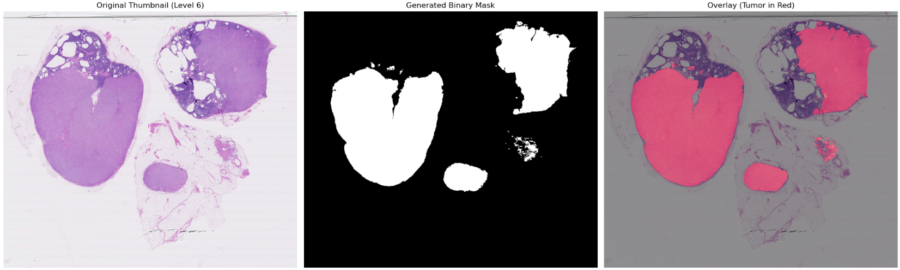
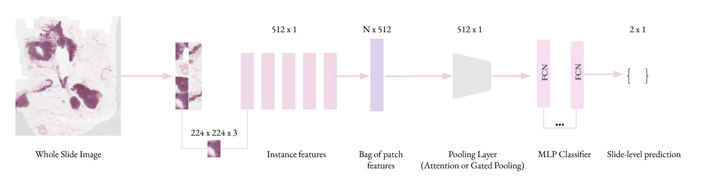

<div align="center">
  <h1 style="color:#1976D2; font-weight:bold; border-bottom:4px solid #1976D2; padding-bottom:10px; margin-bottom:0;">ss25_Hierarchical_Multiscale_Image_Classification</h1>
  <h2 style="color:#1976D2; font-weight:bold; margin-top:0;">HiPAC — Hierarchical Patch-based Adaptive Classifier</h2>
  <p><b>Repository to detect cancer metastasis on lymph node</b></p>
  
  <br>
  
  
  
</div>

<hr style="border:2px solid #1976D2; margin: 20px 0;"/>

</div>
<div align="center">
  <p><b>Architechture for MIL Pooling Classification using a residual feature extractor</b></p>
  
</div>
<h2 align="center" style="color:#1976D2; font-weight:bold; border-bottom:2px solid #1976D2;">Installation</h2>


<div align="center">

<b>Clone the repository and install dependencies:</b>

```sh
git clone https://github.com/yourusername/ss25_Hierarchical_Multiscale_Image_Classification.git
cd ss25_Hierarchical_Multiscale_Image_Classification
pip install -r requirements.txt
```


<hr style="border:2px solid #1976D2; margin: 20px 0;"/>


<h2 align="center" style="color:#1976D2; font-weight:bold; border-bottom:2px solid #1976D2;">Usage</h2>


<div align="center">
All commands are run from the root of the repository:

```sh
python src/main.py [OPTIONS]
```
</div>

<hr style="border:1.5px solid #1976D2; margin: 20px 0;"/>


<details>
<summary><b>Show CLI Options and Flags</b></summary>


<div align="left">

<ul>
  <li><b>--download</b>: Download the CAMELYON16 dataset.</li>
  <li><b>--base_dir BASE_DIR</b>: Set the base directory for downloaded files (default: <code>./data</code>).</li>
  <li><b>--remote</b>: Download all files (default downloads only a subset for testing).</li>
  <li><b>-p, --patch</b>: Extract patches from WSIs.</li>
  <li><b>--patch_level LEVEL</b>: WSI level for patch extraction (0, 1, 2, 3, or 'all').<br>
    <ul>
      <li>Level 0: 1792x1792</li>
      <li>Level 1: 896x896</li>
      <li>Level 2: 448x448</li>
      <li>Level 3: 224x224</li>
      <li>Example:<br>
        <code>python src/main.py --patch --patch_level 0</code><br>
        <code>python src/main.py --patch --patch_level all</code>
      </li>
    </ul>
  </li>
  <li><b>-prep, --prepare</b>: Prepare data (create validation set, extract masks, etc).</li>
  <li><b>-val, --validation</b>: Create a validation set (5 normal + 5 tumor images).</li>
  <li><b>-train, --train</b>: Train a ResNet18 classifier on extracted patches (default, weighted loss for class imbalance).</li>
  <li><b>--train_strategy</b>: Train a ResNet18 classifier with a specific strategy. Use with <b>--strategy</b>.</li>
  <li><b>--strategy STRATEGY</b>: Training strategy for ResNet classifier. Options:
    <ul>
      <li><b>self_supervised</b>: Use SimCLR pretraining for feature extraction.</li>
      <li><b>balanced</b>: Balance the number of tumor and normal patches in the training set.</li>
      <li><b>weighted_loss</b>: Use weighted loss for class imbalance (default for <b>--train</b>).</li>
      <li>Example:<br>
        <code>python src/main.py --train_strategy --strategy balanced</code><br>
        <code>python src/main.py --train_strategy --strategy self_supervised</code><br>
        <code>python src/main.py --train_strategy --strategy weighted_loss</code>
      </li>
    </ul>
  </li>
  <li>If you encounter CUDA errors or want to debug GPU operations, you can run with:<br>
    <code>CUDA_LAUNCH_BLOCKING=1 python src/main.py --train_strategy --strategy self_supervised</code><br>
    This will force synchronous CUDA execution and provide more informative error messages.
  </li>
  <li><b>--extract_features</b>: Extract feature vectors from patches using ResNet18.</li>
  <li><b>--check_structure</b>: Check if the directory structure is correct.</li>
</ul>

</div>

</details>

<hr style="border:1.5px solid #1976D2; margin: 20px 0;"/>


<h2 align="center" style="color:#1976D2; font-weight:bold; border-bottom:2px solid #1976D2;">Example Workflows</h2>


<div align="center">

<table>
  <tr><td><b>Download a small subset for testing:</b></td></tr>
</table>

```sh
python src/main.py --download
```

<table>
  <tr><td><b>Download the full dataset:</b></td></tr>
</table>

```sh
python src/main.py --download --remote
```

<table>
  <tr><td><b>Extract patches at a level:</b></td></tr>
</table>

```sh
python src/main.py --patch --patch_level 1
```

<table>
  <tr><td><b>Extract patches at all levels:</b></td></tr>
</table>

```sh
python src/main.py --patch --patch_level all
```

<table>
  <tr><td><b>Prepare data (validation set, masks):</b></td></tr>
</table>

```sh
python src/main.py --prep
```

<table>
  <tr><td><b>Create validation set only:</b></td></tr>
</table>

```sh
python src/main.py --val
```

<table>
  <tr><td><b>Train ResNet18 classifier:</b></td></tr>
</table>

```sh
python src/main.py --train
```

<table>
  <tr><td><b>Extract features from patches:</b></td></tr>
</table>

```sh
python src/main.py --extract_features
```

<table>
  <tr><td><b>Check directory structure:</b></td></tr>
</table>

```sh
python src/main.py --check_structure
```

</div>

<hr style="border:2px solid #1976D2; margin: 20px 0;"/>


<h2 align="center" style="color:#1976D2; font-weight:bold; border-bottom:2px solid #1976D2;">📁 Directory Structure</h2>


```text
data/
└── camelyon16/
    ├── train/
    │   └── img/
    ├── val/
    │   └── img/
    ├── test/
    │   └── img/
    ├── masks/
    │   ├── lesion_annotations.zip
    │   └── annotations/
    └── patches/
        └── level_0/
            ├── normal_001/
            ├── tumor_001/
            └── ...
        └── level_1/
        └── level_2/
        └── level_3/
```

<hr style="border:2px solid #1976D2; margin: 20px 0;"/>


<h2 align="center" style="color:#1976D2; font-weight:bold; border-bottom:2px solid #1976D2;">⚙️ Configuration</h2>


- Modify [`src/config.py`](src/config.py) to adjust paths, hyperparameters, and experiment settings.


<h2 align="center" style="color:#1976D2; font-weight:bold; border-bottom:2px solid #1976D2;">📄 Citation</h2>

<div align="center">
If you use this codebase, please cite the repository and the CAMELYON16 dataset.
</div>


<h2 align="center" style="color:#1976D2; font-weight:bold; border-bottom:2px solid #1976D2;">📝 License</h2>

<div align="center">
This project is licensed under the MIT License. See <a href="LICENSE">LICENSE</a> for details.
</div>
