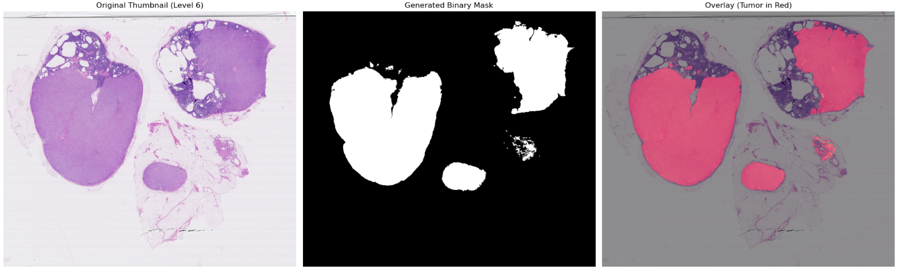

# ss25_Hierarchical_Multiscale_Image_Classification
HiPAC — Hierarchical Patch-based Adaptive Classifier.
Repository to detect cancer metastasis on lymph node. 
<p align="center">
  
</p>

## Installation

1. Clone the repository:
    ```sh
    git clone https://github.com/yourusername/ss25_Hierarchical_Multiscale_Image_Classification.git
    cd ss25_Hierarchical_Multiscale_Image_Classification
    ```

2. Install dependencies:
    ```sh
    pip install -r requirements.txt
    ```

## Usage

All commands are run from the root of the repository:

```sh
python src/main.py [OPTIONS]
```

### Options and Flags

- `--download`  
  Download the CAMELYON16 dataset.

- `--base_dir BASE_DIR`  
  Set the base directory for downloaded files (default: `./data`).

- `--remote`  
  Download all files (default downloads only a subset for testing).

- `-p`, `--patch`  
  Extract patches from WSIs.

- `--patch_level LEVEL`  
  WSI level for patch extraction (`0`, `1`, `2`, `3`, or `'all'` for all levels).  
  - Level 0: 1792x1792  
  - Level 1: 896x896  
  - Level 2: 448x448  
  - Level 3: 224x224  
  - Example:  
    ```sh
    python src/main.py --patch --patch_level 0
    python src/main.py --patch --patch_level all
    ```

- `-prep`, `--prepare`  
  Prepare data (create validation set, extract masks, etc).

- `-val`, `--validation`  
  Create a validation set (5 normal + 5 tumor images).

- `-train`, `--train`  
  Train a ResNet18 classifier on extracted patches (default, weighted loss for class imbalance).

- `--train_strategy`  
  Train a ResNet18 classifier with a specific strategy. Use with `--strategy`.

- `--strategy STRATEGY`  
  Training strategy for ResNet classifier. Options:
    - `self_supervised`: Use SimCLR pretraining for feature extraction.
    - `balanced`: Balance the number of tumor and normal patches in the training set.
    - `weighted_loss`: Use weighted loss for class imbalance (default for `--train`).
  Example:
    ```sh
    python src/main.py --train_strategy --strategy balanced
    python src/main.py --train_strategy --strategy self_supervised
    python src/main.py --train_strategy --strategy weighted_loss
    ```

  If you encounter CUDA errors or want to debug GPU operations, you can run with:
    ```sh
    CUDA_LAUNCH_BLOCKING=1 python src/main.py --train_strategy --strategy self_supervised
    ```
  This will force synchronous CUDA execution and provide more informative error messages.

- `--extract_features`  
  Extract feature vectors from patches using ResNet18.

- `--check_structure`  
  Check if the directory structure is correct.

---

### Example Workflows

**Download a small subset for testing:**
```sh
python src/main.py --download
```

**Download the full dataset:**
```sh
python src/main.py --download --remote
```

**Extract patches at a level:**
```sh
python src/main.py --patch --patch_level 1
```

**Extract patches at all levels:**
```sh
python src/main.py --patch --patch_level all
```

**Prepare data (validation set, masks):**
```sh
python src/main.py --prep
```

**Create validation set only:**
```sh
python src/main.py --val
```

**Train ResNet18 classifier:**
```sh
python src/main.py --train
```

**Extract features from patches:**
```sh
python src/main.py --extract_features
```

**Check directory structure:**
```sh
python src/main.py --check_structure
```

---

## Directory Structure

```
data/
└── camelyon16/
    ├── train/
    │   └── img/
    ├── val/
    │   └── img/
    ├── test/
    │   └── img/
    ├── masks/
    │   ├── lesion_annotations.zip
    │   └── annotations/
    └── patches/
        └── level_0/
            ├── normal_001/
            ├── tumor_001/
            └── ...
        └── level_1/
        └── level_2/
        └── level_3/
```

---

## Configuration

- Modify [`src/config.py`](src/config.py) to adjust paths, hyperparameters, and experiment settings.

## Citation

If you use this codebase, please cite the repository and the CAMELYON16 dataset.

## License

This project is licensed under the MIT License. See [LICENSE](LICENSE) for details.
